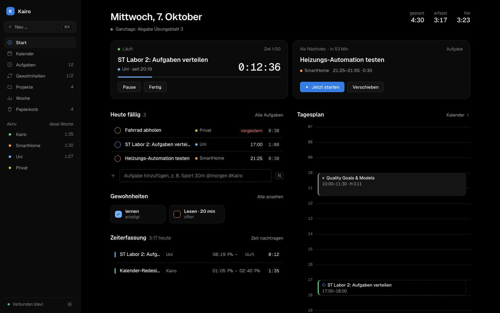
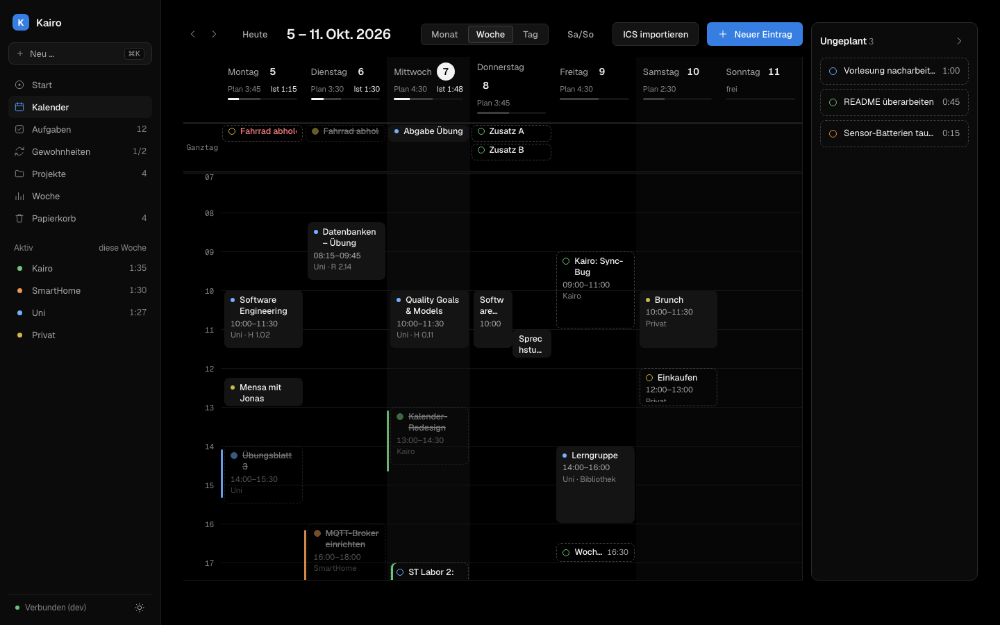
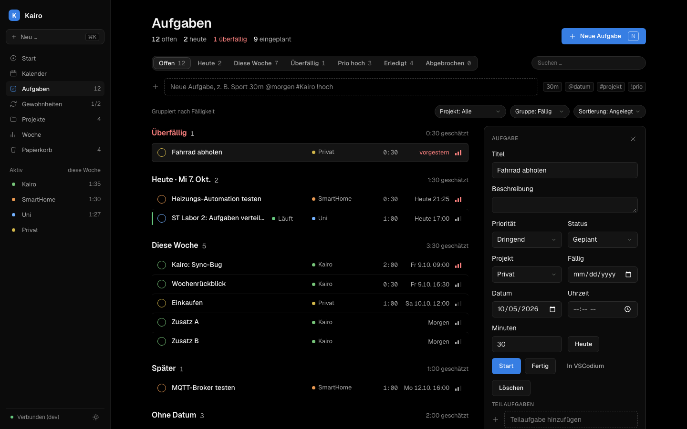

# Kairo

Kairo ist ein lokaler Planer für Aufgaben, Termine und Gewohnheiten. Geplant wird in der WebUI, gearbeitet wird in VSCodium. Die Daten liegen in einer SQLite-Datei auf dem eigenen Rechner, einen Cloud-Dienst gibt es nicht.

Die Zeiterfassung läuft über echte Zeitstempel. Ein Timer startet nur durch eine ausdrückliche Aktion, nie weil ein Ordner geöffnet wurde.







Die Bilder zeigen Mock-Daten aus `frontend/scripts/shot.mjs`.

## Was es kann

Die WebUI hat sieben Ansichten. **Start** zeigt, was gerade läuft und was als Nächstes ansteht, dazu den Tagesplan mit Drag-and-drop. Im **Kalender** liegen Termine (auch als Wochenserie) und geplante Aufgaben nebeneinander, daneben die erfasste Zeit. Der **ICS-Import** aktualisiert Termine mit bekannter UID. **Aufgaben** nehmen eine Schnellschreibweise an, etwa `Sport 30m @morgen #Kairo !hoch`, und lassen sich über Tastenkürzel bedienen. Dazu kommen **Gewohnheiten** mit 28-Tage-Raster, **Projekte** mit Farbe, Ressourcen und Zeitsummen, der **Wochenrückblick** und ein **Papierkorb**. Aufgaben, Termine und Gewohnheiten landen beim Löschen zuerst dort. Löschen, Erledigen und Verschieben bieten einen Rückgängig-Toast.

Die Extension für VSCodium erkennt das Projekt zum geöffneten Ordner und zeigt die Tasks von heute. Sie startet, pausiert und schließt Tasks, auch aus der Statusleiste. Ein Klick auf „In VSCodium“ in der WebUI öffnet den Projektordner samt Ressourcen der Task. Bei Inaktivität fragt sie nach, statt die Zeit weiterlaufen zu lassen.

Für die macOS-Menüleiste liegt ein SwiftBar-Plugin in `tools/menubar/`.

## Aufbau

```
WebUI (Vue 3)      ─┐
Extension          ─┼─ HTTP + WebSocket ─ Backend (Go) ─ SQLite
SwiftBar-Plugin    ─┘
```

| Ordner | Inhalt |
|---|---|
| `backend/` | Go, `net/http`, SQLite ohne cgo. Schichten: `api`, `service`, `domain`, `repository` |
| `frontend/` | Vue 3, TypeScript, Vite, PrimeVue, FullCalendar |
| `extension/` | VSCodium-Extension in TypeScript |
| `tools/` | SwiftBar-Plugin |
| `docs/` | Vision, Anforderungen, Architektur, Roadmap, Reviews |

Backend und SQLite sind die einzige Quelle der Wahrheit. WebUI und Extension speichern keine Produktdaten. Das Schema ändert sich ausschließlich über Migrationen in `backend/migrations/`.

## Voraussetzungen

- Go in der Version aus `backend/go.mod`
- Node.js ab 22.18 (die Frontend-Tests führen TypeScript direkt aus)
- VSCodium oder VS Code für die Extension

Entwickelt wird unter macOS. Autostart und Menüleiste gibt es nur dort, das Backend selbst ist nicht an macOS gebunden.

## Schnellstart

```sh
make install     # npm ci in frontend/ und extension/
make build       # baut die WebUI und danach das Backend
./backend/bin/kairo
```

Die WebUI läuft dann unter <http://127.0.0.1:8742>. Das Binary enthält die WebUI, es braucht keinen zweiten Prozess. Die Reihenfolge in `make build` ist wichtig, weil `embed` beim Kompilieren greift.

Autostart bei jedem Login (macOS):

```sh
cp backend/bin/kairo ~/.local/bin/kairo
kairo install      # entfernen: kairo uninstall
kairo backup       # Kopie der Datenbank nach backups/ neben der Datenbank
```

Beim Serverstart legt Kairo außerdem selbst ein Backup an.

## Entwicklung

Zwei Terminals:

```sh
cd backend  && go run ./cmd/server           # http://127.0.0.1:8742
cd frontend && npm run dev                   # http://127.0.0.1:5173, leitet /api und /ws ans Backend
```

Alle Prüfungen auf einmal, so wie sie auch die CI ausführt:

```sh
make check
```

Das sind `gofmt`, `go vet` und `go test` im Backend, Typprüfung und Tests im Frontend sowie Kompilieren und Tests der Extension.

UI-Änderungen werden angesehen, nicht nur gebaut. Mit laufendem `npm run dev` erzeugt `npm run shot` ein Bild mit Mock-Daten in `frontend/.shots/`:

```sh
cd frontend
npm run shot -- --view week|work|day|month     # Kalender
npm run shot -- --route tasks|habits|projects|review|trash [--theme light] [--size 1280x800]
```

## Konfiguration und Sicherheit

Das Backend bindet sich immer an `127.0.0.1`. Schreibende Aufrufe brauchen einen eigenen `Origin` oder das Token aus `~/.config/kairo/token`. Port, Datenbankpfad und Zeitzone stellt man über Umgebungsvariablen ein. Die Tabelle steht in [`backend/README.md`](backend/README.md).

## Dokumentation

- [Vision](docs/00_VISION.md): Idee, Ziele und Leitprinzipien
- [Produktanforderungen](docs/01_PRODUCT_REQUIREMENTS.md)
- [Architektur](docs/02_ARCHITECTURE.md): Komponenten, Datenmodell, Struktur
- [Regeln für Agenten](docs/03_AGENT_GUIDELINES.md) und [Einstieg für Agenten](docs/04_AGENT_HANDOFF.md)
- [Roadmap](docs/05_ROADMAP.md): Phasen 0 bis 7 sind gebaut
- [Design-Review](docs/06_DESIGN_REVIEW.md) und [UX-Review](docs/07_UX_REVIEW.md)
- [Designsystem](docs/design-system/index.html): Tokens und Komponenten als Vorlage

Die Extension beschreibt [`extension/README.md`](extension/README.md), das Frontend [`frontend/README.md`](frontend/README.md).
